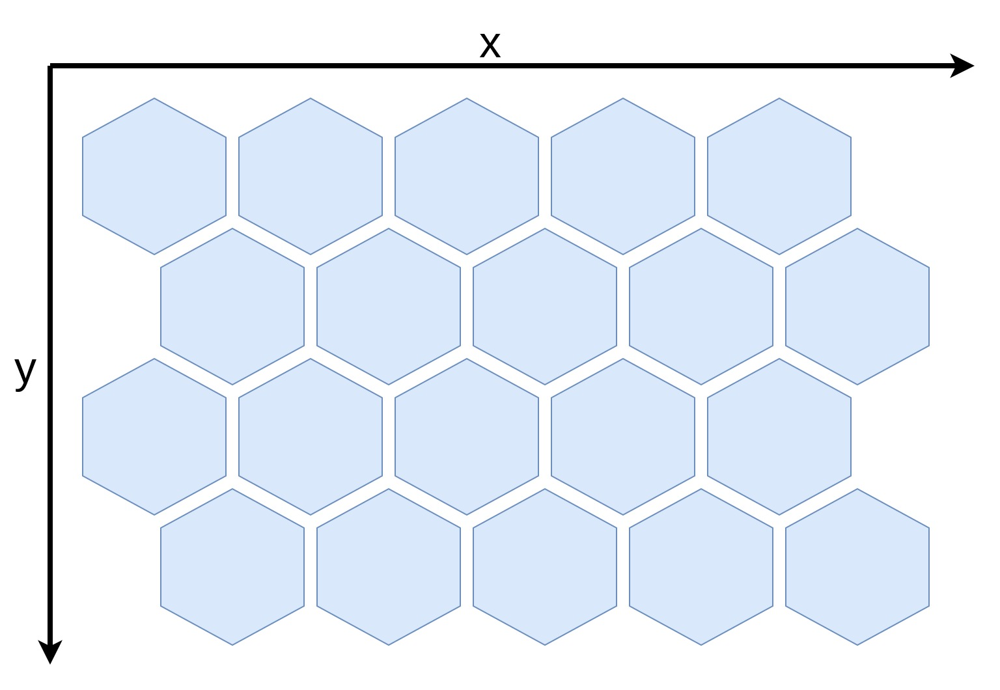
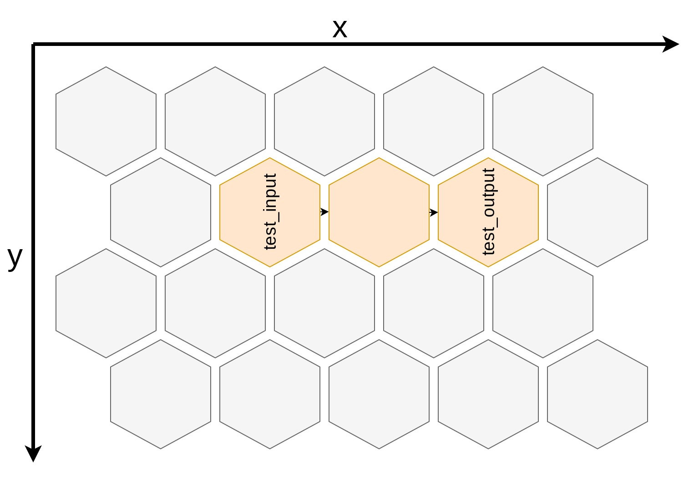

# Cluster Templates

## General 

The cluster-templates are used to define the basic structure of a network. This defined structure is comparable to a plant trellis. It is basically structures in hexagons, which are called bricks.



General structure of the file:

```
version: 1
bricks:
    <X>,<Y>,<Z>
        input: <NAME>
        number_of_neurons: <NUMBER_OF_NEURONS>
    <X>,<Y>,<Z>
        number_of_neurons: <NUMBER_OF_NEURONS>
    ...
    <X>,<Y>,<Z>
        output: <NAME>
        number_of_neurons: <NUMBER_OF_NEURONS>
```

In the template the position, type, name and size of the bricks has to be defined. 

- **position:**

    `<X>,<Y>,<Z>` the x-, y- and z-coordinates of the brick. All bricks must be connected by at least one side with another brick.

- **type:**

    `input` and `output` defining the type of the brick. Input-bricks can get input-values, while output-bricks returning values at the end of a run. If noting of them was set, the brick is a normal internal brick, which can not be accessed directly from the outside.

- **name:**

    `<NAME>` have to be set to the name, which should identify the brick to place input- and output-values.

- **size:**

    `<NUMBER_OF_NEURONS>` has to be replace by the number of neurons of the brick. For input-bricks it is the number of input-values and same for the output-brick. For normal internal bricks the number is only a maximum value, which can be used while learning. So making this insanely high, doesn't improve the quality of the training.

!!! info

    It is theoretically possible to order them 3-dimensional by using different z-values, but this was never tested until now.

## Simple example

The following is a minimal example for a cluster-template.

```
version: 1
bricks:
    1,1,1
        input: test_input
        number_of_neurons: 784
    2,1,1
        number_of_neurons: 400
    3,1,1
        output: test_output
        number_of_neurons: 10
```

It defines 3 bricks. It contains an input-brick with the name `test_input` and an output-brick with name `test_output`. Based on their position, they are all in a straight line, like in the image below:




