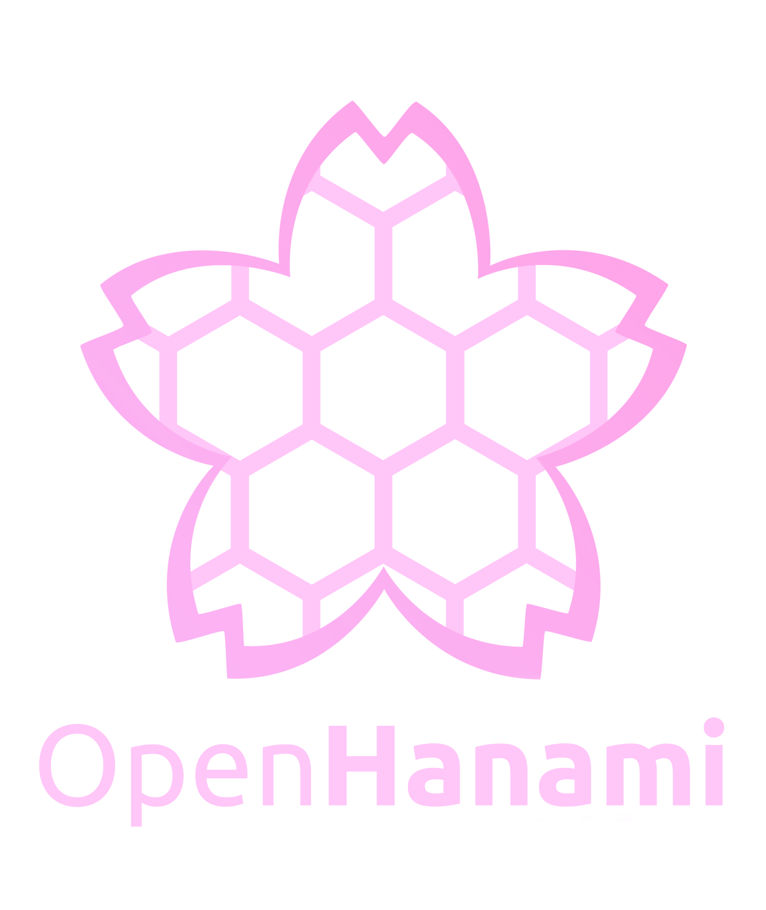

# Hanami-AI

!!! danger "IMPORTANT"

    **This project is still an experimental prototype at the moment and NOT ready for productive usage.** 

    There is still a huge bunch of known bugs and missing validations, which can break the backend. Even the documentation here is quite basic. Normally I absolutely dislike it to make something public, which has known bugs and other problems, but I simply don't wanted to wait longer for the open-sourcing of this project. Most of it will be fixed until [Version `0.2.0`](/#roadmap). Keep in mind, that this project is created by a single person in his spare time beside a 40h/week job. ;)

!!! info

    At this documentation here at the moment is the develop-branch version. So this site will follow the develop-branches of the single components. Additionally there will be continuously updates of things, which are still missing in general in this documentation, like config-descriptions, sequence diagrams, manual to build docker-images and so on.

??? question "Why it is named `Hanami-AI`?"

    "Hanami" is the japanese word for viewing blossoms and primary cherry blossoms. I love the cherry blossom season in Japan and I would be absolute happy, when I can see them again, after COVID-19 prevented me for 3 seasons from visiting Japan. I hope that, despite all new problems like inflation, energy shortage and so on, I will be able to see them again in the near future, and if anyway possible I would like to live in Japan, at least for a few years. Maybe this project here lead to some good job opportunities to make this possible.

??? question "Why this project was created?"

    Originally it was only a tiny single repository for some experimental workings with artificial neural networks. The goal was simple to create something, which is not so static like the classical existing networks. Over time more an more interestingly looking features were added. It was also a good opportunity to improve my programming skills and experiment with new programming languages, frameworks and other technologies. In this process the project become more and more bigger to what it is now. 

??? question "Why this logo?"

    The cherry-blossom is related to the project-name `Hanami-AI` and the hexagons represent the base-structure of the network (see [Internal documentation](/Inner_Workings/3_kyouko/#core-segment)). Originally this logo was invented in my old automation tool [SakuraTree](https://github.com/kitsudaiki/SakuraTree), which was created to deploy Hanami-AI on server, before I learned Kubernetes. But the logo was too good in my opinion, so I reused it for this project here, to not waste it.

## Intro

Hanami-AI is basically an AI-as-a-Service project, based on a concept created by myself. It is written from scratch with a Backend in C++ with Web-frontend.

The actual prototype consists of:

- partially implementation of an own concept for an artificial neuronal network. It has no fixed connections between the nodes, but creates connections over time while learning. Additionally it doesn't need a normalization of input-values and this way it can also handle unknown data as input. This should make it flexible and efficient. The current state is extremely experimental.
- multi-user- and multi-project-support, so multiple-users can share the same physical host
- basic energy-optimization supporting the scheduling of threads of all components and changing the cpu-frequency based on workload
- basic monitoring of cpu-load
- Webfrontend with client-side rendering and SDK-library
- Websocket-connection to directly interact with the artificial neuronal networks
- CI-pipelines, Test-Tool, Docker-build-process and basic helm-chart to deploy the project on Kubernetes

## First benchmark

Test-case:

- Dataset: MNIST handwritten letters
- Hardware: Intel i7-1165G7 and 16GB RAM with 3200MT/s
- Settings: 
    - **CPU** with **one processing thread** 
    - **no batches**, so each of image is processed one after the other
    - values are pushed directly into the network without normalization between 0 and 1
    - average of 10 measurements

|             |      average result        |
| ----------- | ------------------------------------ |
| time for train-dataset (60000 Images); 1. epoch  | 1.9 s |
| time for test-dataset (10000 Images)       |  0.1 s |
| accuracy of test-dataset after 1. epoch   |  94.21 % |
| accuracy of test-dataset after 10. epoch   |  96.43 % |

!!! info

    In an older version there was already a state, where up to *98,1%* were correct with a similar speed, but removing the limitation for the input-values to be able to handle much bigger values had its price, but I think this exchange was it worth. Some things are still missing in the implementation and there is still much space for optimization and research, so I think this is not the maximum possible at the moment.

## Possible use-case

Because the normalization of input is not necessary, together with the good performance of training single inputs (based on the benchmark) and the direct interaction remotely over websockets, could make this project useful for processing measurement-data of sensors of different machines, especially for new sensors, where the exact maximum output-values are unknown. So continuous training of the network right from the beginning would be possible, without collecting a bunch of data at first.

## Basics

-   :material-clock-fast:{ .lg .middle } __Getting Started__

    ---

    Installation-Guide to deploy HanamiAI on a kubernetes

    [:octicons-arrow-right-24: Installation](/How_To/1_installation/)

-   :material-monitor-dashboard:{ .lg .middle } __First Look__

    ---

    To get a first impression there is a first example-workflow via the dashboard. 

    For the naming at some points look into the [Glossar](/other/2_glossar)

    [:octicons-arrow-right-24: Dashboard](/How_To/2_dashboard/)

-   :material-file-document-multiple-outline:{ .lg .middle } __Inner workings__

    ---

    Even it is quite basic for now, there are also some internal workflow and tasks of the single components described.

    [:octicons-arrow-right-24: Docu of inner workings](/Inner_Workings/1_overview/)

-   :octicons-package-dependencies-24:{ .lg .middle } __Dependencies__

    ---

    Many basic dependencies were created in context of this project. Here is an overview of all involved repositories.

    [:octicons-arrow-right-24: Dependencies](/other/1_dependencies/)

## Core-components

for more details see [Documentation inner workings](/Inner_Workings/1_overview/)

- **Kyouko**
    - Content: Core-component, which holds the artificial neuronal networks.
    - Repository: [KyoukoMind](https://github.com/kitsudaiki/KyoukoMind.git)
    - prebuild Docker-Image: `kitsudaiki/kyouko_mind`

- **Misaki**
    - Content: Authentication-service and management of user
    - Repository: [MisakiGuard](https://github.com/kitsudaiki/MisakiGuard.git)
    - prebuild Docker-Image: `kitsudaiki/misaki_guard`

- **Shiori**
    - Content: Storage-component, which holds snapshots, logs and so on
    - Repository: [ShioriArchive](https://github.com/kitsudaiki/ShioriArchive.git)
    - prebuild Docker-Image: `kitsudaiki/shiori_archive`

- **Azuki**
    - Content: Monitoring and energy-optimization
    - Repository: [AzukiHeart](https://github.com/kitsudaiki/AzukiHeart.git)
    - prebuild Docker-Image: `kitsudaiki/azuki_heart`

- **Torii**
    - Content: Proxy for all incoming connections
    - Repository: [ToriiGateway](https://github.com/kitsudaiki/ToriiGateway.git)
    - prebuild Docker-Image: `kitsudaiki/torii_gateway`

- **Dashboard**
    - Content: Web-Frontend
    - Repository: [Dashboard](https://github.com/kitsudaiki/Hanami-AI-Dashboard.git)
    - prebuild Docker-Image: `kitsudaiki/hanami_ai_dashboard`

## Roadmap

- **0.1.0**
    - *content*: 
        - first prototype with basic feature-set

- **0.2.0**
    - *expected date*: end Q4 2022 / begin Q1 2023
    - *content*: 
        - no new features but only improving the current state with:
            - bugfixes
            - additional validation
            - more documentation
            - ...

- **0.3.0**
    - *expected date*: end Q2 2023
    - *content*: 
        - complete implementation of the core-concept and further evaluation and improvement of the learning-process:
            - allow to use it as spiking-neuronal-network
            - remove strict layer-structure, which is still enforced by hard configuration at the moment
            - build 3-dimensional networks
        - further evaluation and improving of the core-process
        - add classical static neuronal networks with GPU-support

- **0.4.0**
    - *expected date*: Q4 2023
    - *content*: 
        - first Multi-Node-Setup

## Issue-Overview

[Hanami-AI-Project](https://github.com/users/kitsudaiki/projects/9/views/4)

## Author

Tobias Anker

eMail: tobias.anker@kitsunemimi.moe

## License

The complete project is under Apache 2 license.

## Contributing

I'm happy, if you find the project interesting enough to contribute code. In this case, please wait until version `0.2.0`, because there are many API- and Database-breaking changes on the project. Additionally until `0.2.0` I will also provide a Code-Styling-Guide (at least for the C++-backend).
