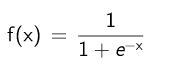
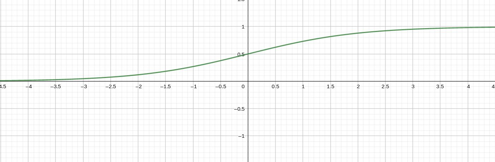

# Core

## Retrospect

Before this project grows into the AI-as-a-Service, which it is now, Kyouko was the only component. The primary goal at this point was, to create a network, which is closer to the real functionality of the brain, then the classical deep-learning-networks. 

The first working PoC was at the beginning of 2019 was an exaggerated version. It was the result of a try-and-error-process. Extreme dynamic, but horribly slow with very high memory consumption. Additionally it required manually input and was hard to handle, which made it impossible to train more then a few single values. Interesting as PoC, but from practical perspective totally useless.

In the further development the dynamic was massively reduced in order to increase the performance and reduce memory-usage. It was a fight between the concept and the restrictions of compute-hardware. Additional some optional features were removed, to focus more on the base. The primary target was to bring the network to a state, where it can automatically train the whole MNIST-set in a suitable time. The first version, which was able to do this, took 15min to train the 60000 images and had a test-result of 30-50% correctness, which was also horrible. After many more optimization and fixing, it now need only a few seconds for learning and reach up to 97%.

In this process were also 2 attempts in the past to bring this on a GPU with OpenCL. The results were slower, then on CPU. Because of this, the GPU-support was removed, to focus on CPU for now. 

## Basic internal structure

This is a short overview of the actual inner workings.


The graphic shows a simple Cluster, consist of input, output and a bunch of bricks.

### Brick-processing


Internally it is structured into Bricks. These are again only a name for a logical structuring for a more effective workflow and resource-handling. The named like this, because the are connected to each other like classical LEGO-bricks. Each Brick contains, based on its configuration, up to 2^16-1 artificial neurons. The reason for this limitation is performance and memory-consumption. Based on its [activation-function](/Inner_Workings/3_kyouko/#activation-function) they are only active, when the input is positive. Otherwise they are skipped. In case that the input comes from an Input-Segment, the activation-functions isn't used. Instead the data are used plain. Connected to the neurons are a chain of synapse-sections. These structs, which hold multiple synapses and are bounded to a brick. Which brick is decided random when creating the section, based on a list of possible target-bricks, based on the location. The input coming from the neuron runs through the synapses one after another and becomes weaker by each passed synapse. The synapses, which are passed and triggered, do again trigger the connected neuron within the Brick. The initial settings of new synapses, like the weakening-effect, are set quite random within some restrictions. At the end of the section, it can go to the next section in another Brick. If a signal still exist at the end of all existing synapses of the chain, then new one will be created. If the input-signal disappear because of the weakening-effect before it reaches the end, then the last synapses of the chain are not processed and have NO effect on their connected neurons. 

This chain is only processed, if the input of a neuron is greater then 0. The input coming from the neuron has basically no upper limit. The bigger the input, the bigger the weakening-effect of new created synapses. 

Synapses can not only create or adjusted, but also deleted again for various reasons. One reason is a activation-counter. If a synapse is not used at least 100 time (hard-coded at the moment), then it becomes weaker and will eventually deleted again. So you could say the network can basically forget things again, if it wasn't learned enough. With the MNIST-Dataset with its 60000 images, which effect not really triggered and tables in form of CSV are not long enough implemented to find the time to test this feature better

### Activation-function

The activation-function of the neurons doesn't use the classical sigmoid function. The requirements of a function for this part were:

1. only active for input greater `0`
2. no hard upper limit at `1`, like it is the case for the sigmoid function

The following function was selected based on these criteria:


### Output

The o utput are similar to the input.


They have like the input a 1:1 connection between in output-nodes and the output-buffer. In additional they normalize the outgoing values to the range of 0.0-1.0 with the help of the classical sigmoid function:





The `x` are the values coming from the output-buffer and the `f(x)` is the output of the network.

## Templates

At the moment the order and configuration of the Bricks of a Cluster are defined by strings in a custom format. 


### Cluster-Templates

```
version: 1
settings:
    max_synapse_sections: 1000

bricks:
    1,1,1
        input: test_input
        number_of_neurons: 20
    2,1,1
        number_of_neurons: 10
    3,1,1
        output: test_output
        number_of_neurons: 5
```

#### Bricks

The `bricks` defining, which the bricks are ordered within the cluster. 

- This type-identifier is followed by a name, which is later used to identify the brick while connecting the bricks in the [Cluster-templates](/internal/3_kyouko/#cluster-templates).

- positions like `1,1,1` defining with `x`, `y` and `z` value the position of the brick within the cluster. In this example, it only defines a row of 3 bricks. Together with the hard-coded limitation, that bricks can actuall only connect to neighbors, this enforce the network to grow in a classical layer-structure.

#### Settings

- `max_synapse_sections`: Maximum number of synapse-sections, which are allowed to be allocated in the memory to limit the size and avoid that the whole available memory is filled up, because of a misconfiguration.

- `sign_neg`: average relation of negative synapses to positive synapses in the network (1.0 = all negative, 0.0 = nothing negative)

