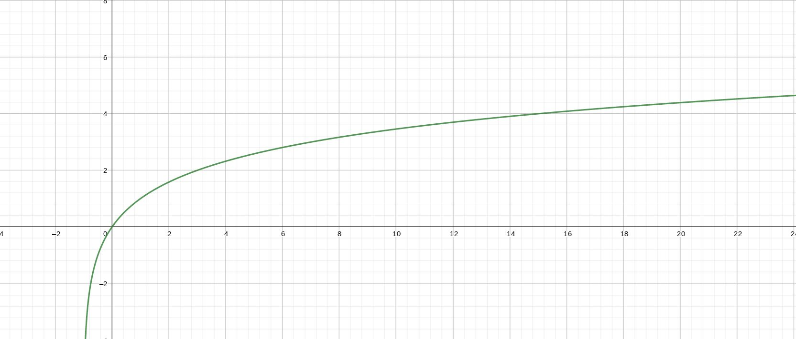
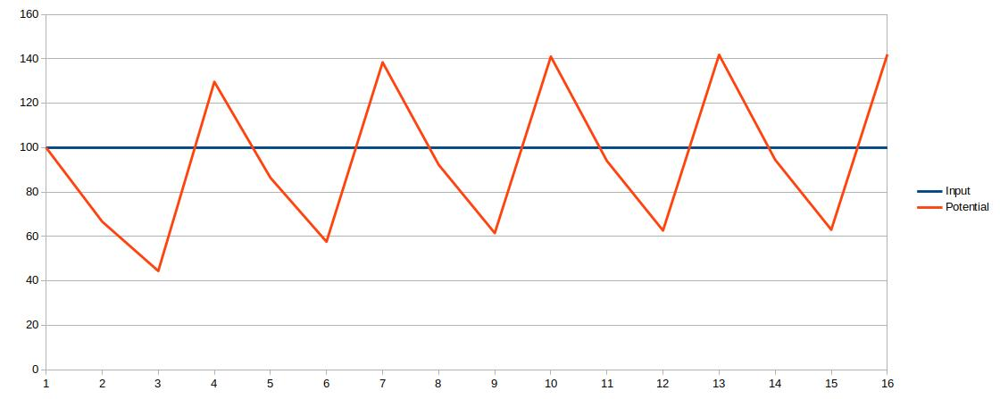

# Core

This is a short overview of the current inner workings.

## Basic architecture

A neural network in this project is called `cluster`, which consist of multiple hexagons, called
`hexagon` in this context, like below.

They are called hexagons, because they building the base-structure of the neural network, so they
stick together like hexagons. There are input-hexagons (orange) and output-hexagons (red) to define,
where data go into the neural network and where to leave the network. These two types have also
names, which map input and output to the desired hexagon.

### Hexagon-processing

Internally it is structured into Hexagons. These are again only a name for a logical structuring for
a more effective workflow and resource-handling. The named like this, because the are connected to
each other like classical LEGO-hexagons. Each Hexagon contains, based on its configuration, up to
2^16-1 artificial neurons. The reason for this limitation is performance and memory-consumption.
Based on its [activation-function](/inner_workings/core/core/#activation-function) they are only
active, when the input is positive. Otherwise they are skipped. In case that the input comes from an
Input-Segment, the activation-functions isn't used. Instead the data are used plain. Connected to
the neurons are a chain of synapse-sections. These structs, which hold multiple synapses and are
bounded to a hexagon. Which hexagon is decided random when creating the section, based on a list of
possible target-hexagons, based on the location. The input coming from the neuron runs through the
synapses one after another and becomes weaker by each passed synapse. The synapses, which are passed
and triggered, do again trigger the connected neuron within the Hexagon. The initial settings of new
synapses, like the weakening-effect, are set quite random within some restrictions. At the end of
the section, it can go to the next section in another Hexagon. If a signal still exist at the end of
all existing synapses of the chain, then new one will be created. If the input-signal disappear
because of the weakening-effect before it reaches the end, then the last synapses of the chain are
not processed and have NO effect on their connected neurons.

This chain is only processed, if the input of a neuron is greater then 0. The input coming from the
neuron has basically no upper limit. The bigger the input, the bigger the weakening-effect of new
created synapses.

Synapses can not only create or adjusted, but also deleted again for various reasons. One reason is
a activation-counter. If a synapse is not used at least 100 time (hard-coded at the moment), then it
becomes weaker and will eventually deleted again. So you could say the network can basically forget
things again, if it wasn't learned enough. With the MNIST-Dataset with its 60000 images, which
effect not really triggered and tables in form of CSV are not long enough implemented to find the
time to test this feature better

### Activation-function

The activation-function of the neurons doesn't use the classical sigmoid function. The requirements
of a function for this part were:

1. only active for input greater `0`
2. no hard upper limit at `1`, like it is the case for the sigmoid function

The following function was selected based on these criteria:

### Output

The o utput are similar to the input.

They have like the input a 1:1 connection between in output-nodes and the output-buffer. In
additional they normalize the outgoing values to the range of 0.0-1.0 with the help of the classical
sigmoid function:

The `x` are the values coming from the output-buffer and the `f(x)` is the output of the network.

## Additional features

There are some experimental optional features, which can be enabled. They can be defined in the
[cluster-templates](/frontend/cluster_templates/cluster_template/). There are also a few
[measurement-examples](/inner_workings/measurements/measurements/#reduction_1).

### Reduction

The reduction-process should limit the size of the neural network, by deleting nearly never used
synapses again, which were not capable of reaching the necessary threshold to be persistent.

See the [Example](/inner_workings/measurements/measurements/#reduction_1)

### No strict layer structure

The base of a new neural network is defined by a cluster-template. In these templates the structure
of the network in planed in hexagons, indeed of layer. When a node tries to create a new synapse,
the location of the target-node depends on the location of the source-node within these hexagons.
The target is random and the probability depends on the distance to the source. This way it is
possible to break the static layer structure.

The orange hexagon is the source of the connection. It can be configured, how far a connection can
reach within the hexagon-structure. The red circle show a maximum distance of 1. So all neurons
within the orange hexagon can only connect to neurons within the hexagon within the red circle. The
green circle represents a maximum distance of 2. So the possible target of a new connection can be
anywhere within the green or red circle.

So for a simple lined sequence of hexagons with a maximum distance of **3** it could look like this:

The orage hexagon is the input and the red is the output and the arrows between them are showing
some possible connections, which can appear while learning.

Hexagons, which are near to the source hexagon, have a higher change to become the target, than a
hexagon far away.

A simple path finding process while initializing the structure, search a traces from input- to
output-hexagons. This way it should be prevented an uncontrolled structure and avoid cycles which
the network growth.

### Spiking neural network

This is a feature without a specific use-case in mind and only inspired by the human brain.

It consist of two parameter:

1. Cooldown of the neuron:

    Its the value of how much the potential of a neuron is reduced from one cycle to the next. As
    default it is so high, that the remaining potential has no impact on the next cycle anymore.

2. Refractory-Time:

    Gives the number of cycles until a triggered neuron can be triggered again by the input. Within
    this time-period, only the cooldown of the neuron is active.

The following shows the behavior of a neuron with a constant input of 100, a cooldown of 1,5 and a
refractory time of 3 :

