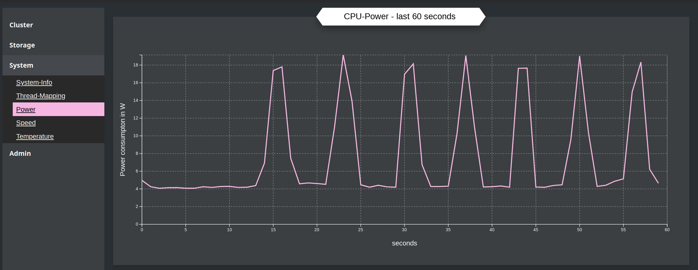

# Monitoring

Their are 4 major tasks to do:

1.  optimize the usage of the hardware by supporting CPU-scheduling of all threads of all components

2.  read and observe system-information of CPU

    !!! info

        Observation of memory, GPU, network and storage comes later.

3.  Change CPU-frequency based on the workload

    !!! warning

        Disabled at the moment because of less priority

4.  measure Power-consumption, thermal output and frequency of the CPU

    !!! info

        Power-consumption works only on Intel-cpus currently and only when the program runs as root.

<!-- ## **Collecting information**

For collecting of hardware-information the library `libKitsunemimiSakuraHardware` is used and interact with other specific libraries in order to get all information of the hardware.

At the moment only CPU related information are collected. The collected data are hold in the data-structure for easier access. In this structure it is easier to identify for example, which two CPU-threads are sharing the same physical CPU-core.
 -->

## **Thread-Binding**

The only energy-optimization, at least for now, is thread-binding.

Each thread, which is created with the thread-class of the library `hanami_common`, has a name
attached. With this name the thread is accessible over the singleton thread-manager-class and can be
accessed from anywhere in the code. Additionally the thread-class possess the ability to bind the
thread to one or more CPU-threads to enforce the location on the CPU, where the thread should be
executed.

In the current version this is quite static and simple. Each worker-thread of hanami, which process
the neural network, runs on the CPU-cores >1 and every other thread is executed on the first
physical CPU-core. It also identifies in case of hyperthreading, which cpu-threads are sharing the
same physical core and consider this, when binding the threads. By enforcing that the 2 threads of
the same physical CPU-core are used, instead of 2 threads on two different cores, it can save much
energy.

## **Controlling CPU frequency**

!!! warning

    Disabled at the moment because of less priority

Hanami can change the frequency of the CPU. It was tested in an earlier state and the result looked
like this:

Every spike in the graph means, that a task comes to be processed. Between the task, the cpu is
enforced to minimal cpu-frequency and so also minimal power consumption.
